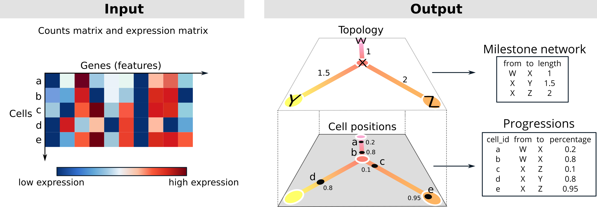

```{r setup, include=FALSE}
knitr::opts_chunk$set(echo = TRUE)
library(hdf5r)

library(purrr)
library(stringr)
library(dplyr)
library(tibble)
library(readr)

library(dynplot2)
library(ggplot2)
library(dynwrap)

theme <- theme(
  panel.border = element_rect(colour = "black", fill=NA, size=1, color = "#999999"),
  legend.position = "none",
  plot.caption = element_text(hjust = 0.5, size = 11),
  plot.title = element_text(hjust = 0.5)
)
```

```{r, echo = FALSE}
find_input_line <- function(x) {
  read_lines(x) %>% 
    stringr::str_which("##### Read data #####")
}
find_output_line <- function(x) {
    read_lines(x) %>% 
    stringr::str_which("##### Save output #####")
}

examples <- tribble(
  ~language,
  "R",
  "Python",
  "Julia",
  "Scala-Spark"
) %>% 
  mutate(folder = paste0("containers/tc-submissions/submission-", tolower(language), "/code/")) %>% 
  mutate(main = fs::dir_ls(folder, regexp = ".*[Mm]ain*")) %>% 
  mutate(
    input_line = map_int(main, find_input_line),
    output_line = map_int(main, find_output_line),
    main_filename = fs::path_file(main)
  )

label_sentence <- function(x) {
  if (length(x) == 0) {
    ""
  } else if (length(x) == 1) {
    x
  } else {
    glue::glue_collapse(x, sep = ", ", last = " and ")
  }
}
```


## Biological background

Cells are constantly changing based on external and internal stimuli. These can include:

- Cell differentiation, a process where cells go from a more stem-cell like state to a specialized state
- Cell division, a process where cells replicate their DNA and split into two new cells
- Cell activation, a process where cells are activated by their environment and react to it

There are several techniques to measure the current state of a cell. In this competition we focus on the transcriptome of a cell, which can be analyzed with _single-cell RNA-seq_ technologies. In the recent years these techniques have scaled up to being able to assess the expression (i.e. activity) of thousands of genes within tens of thousands of cells.

The state of a cell often changes gradually, and so does its transcriptome. If you profile different cells that are all at different stages, you can reconstruct the paths that cells take. These paths are called trajectories, and the methods that infers them from single-cell data are called trajectory inference (TI) methods. An example of such a trajectory is given below, visualized on a 2D dimensionality reduction of a single-cell expression dataset.

```{r, echo = FALSE, fig.width=10, message=FALSE}
set.seed(1)

dataset <- dynplot2::example_bifurcating %>% 
  add_dimred(dyndimred::dimred_landmark_mds)

plot_dataset <- dataset %>% 
  dynplot() +
  geom_cell_point() +
  labs(caption = "A small single-cell dataset visualized in two dimensions using PCA.\n Each dot represents one cell.") +
  theme
plot_trajectory <- dataset %>% 
  dynplot() +
  geom_cell_point(color = "grey") +
  geom_trajectory_segments(aes(colour = milestone_percentages), size = 2) +
  geom_milestone_label(aes(fill = milestone_id)) +
  scale_milestones_fillcolour() +
  labs(caption = "A trajectory inferred from the data, \nwith four milestones (M1, M2, M3 and M4) \nand a bifurcation point at M3.") +
  theme

patchwork::wrap_plots(
  plot_dataset,
  plot_trajectory
)
```

The topology of a trajectory can range from very simple (linear or circular) to very complex (trees or disconnected graphs).

```{r, echo = FALSE, message = FALSE}
datasets <- list(
  linear = dynplot2::example_linear,
  bifurcating = dynplot2::example_bifurcating,
  tree = dynplot2::example_tree,
  disconnected = dynplot2::example_disconnected
)

plot_trajectories <- map2(names(datasets), datasets, function(topology, dataset) {
  plot_trajectory <- dataset %>% 
  dynplot() +
  geom_cell_point(color = "grey") +
  geom_trajectory_segments(aes(colour = milestone_percentages), size = 2, arrow = NULL) +
  scale_milestones_fillcolour() +
  labs(caption = paste0("A ", topology, " trajectory")) +
  theme
})


patchwork::wrap_plots(plot_trajectories)
```

## Problem description

You are given the expression of thousands of genes within thousands of cells. This expression is given as a counts matrix, indicating how often a particular gene was counted within a cell. The goal is to construct a topology that represents these cells, and to place these cells on the correct locations along this topology.



The topology is a graph structure, in this context called the milestone network as it connects "milestones" that cells pass through. Each edge within the milestone network can only be present once, and every edge has an associated length, which indicates how much the gene expression has changed between two milestones.

The cells are placed at a particular position of this milestone network. We represent this as "progressions", where each cell is assigned to an edge and a percentage indicating how far it has progressed in that edge.

### Quick start

To get started, check out the examples we provided for different programming languages. These examples infer a simple linear trajectory by using the first component of a principal component analysis as progression.

```{r, echo = FALSE}
examples %>% 
  mutate(
    show_Example = str_glue("[{language}]({folder})"),
    show_Dockerfile = str_glue("[Dockerfile]({folder}/Dockerfile)"),
    show_Input = str_glue("[{main_filename}#{input_line}]({main}#L{input_line})"),
    show_Onput = str_glue("[{main_filename}#{output_line}]({main}#L{output_line})")
  ) %>% 
  select(matches("show_")) %>% 
  rename_all(~substr(., 6, 9999)) %>% 
  knitr::kable()
```

### Detailed description

You have to write a docker container that will read in the input files and write out the output files in a mounted folder. This container has to have an entrypoint that will ready in two command-line arguments: the first contains the location of the input file, and the second the location of the output folder. Examples of Dockerfiles (and associated entrypoints) are provided for `r examples %>% mutate(link_input = str_glue("[{language}]({folder}/Dockerfile)")) %>% pull(link_input) %>% label_sentence()`. Make sure to specify the entrypoint using the JSON notation as is shown in the examples.

```{r, echo = FALSE}
# read_lines(paste0(examples %>% filter(language == "Python") %>% pull(folder), "/Dockerfile")) %>% c("```python", ., "```") %>% paste0(collapse = "\n") %>% knitr::asis_output()
```

The input file is an HDF5 file, which contains a matrix: the counts (`/data/counts`). This matrix contains the expression of genes (columns) within hundreds to millions of cells (rows). Example HDF5 files are present in the [examples inputs folder](examples/inputs) (_dataset.h5_).

Because the data is very sparse, the matrix is stored inside a sparse format: [Compressed sparse column format (CSC)](https://docs.scipy.org/doc/scipy/reference/generated/scipy.sparse.csc_matrix.html). We provided an example to read in these matrices for `r examples %>% mutate(link_input = str_glue("[{language}]({main}#L{input_line})")) %>% pull(link_input) %>% label_sentence()` . This format stores three sparse array, _i_, _p_ and _x_. _x_ contains the actual values, _i_ contains the row index for each value, and _p_ contains which of the elements of _i_ and _x_ are in each column (i.e. _p_<sub><i>j</i></sub> until _p_<sub><i>j+1</i></sub> are the values from _x_ and _i_ that are in column _j_). We also provide the _rownames_, that correspond to cell identifiers, and the _dims_, the dimensions of the matrix.

As output you have to provide two comma separated files. The _milestone\_network.csv_ is a table containing how milestones are connected (_from_ and _to_) and the lengths of these connections (_length_). The _progressions.csv_ contains for each cell (_cell\_id_) where it is located along this topology (_from_, _to_ and _percentage_ ∈ [0, 1]). Both outputs have to be saved as a comma separated file without an index but with header. Example csv files are present in the [examples outputs folder](examples/outputs) (_progressions.csv_ and _milestone\_network.csv_):

Example _milestone\_network.csv_:
```{r, echo = FALSE, message=FALSE}
readr::read_csv("examples/outputs/bifurcating/milestone_network.csv") %>% knitr::kable()
```

Example _progressions.csv_ (first 10 rows):

```{r, echo = FALSE, message=FALSE}
readr::read_csv("examples/outputs/bifurcating/progressions.csv") %>% head(10) %>% knitr::kable()
```

We provided an example to save these two objects for `r examples %>% mutate(link_input = str_glue("[{language}]({main}#L{output_line})")) %>% pull(link_input) %>% label_sentence()`

## Evaluation

Your output will be compared to the known (or expected) trajectory within both synthetic and real datasets. This is done using four metrics, each contributing (on average) 1/4th to the overall score.

- Similarity between the topology. This will calculate a distance measures between two topologies. The score ignores and "inbetween" milestones, i.e. those with degree 2. It therefore does not matter whether you return a trajectory as a network A->B->C versus A->B. The order of the edges also doesn't matter.

```{r, echo = FALSE, fig.width=10, fig.height = 4}
library(dynplot2)
datasets <- list(
  bifurcating = example_bifurcating,
  bifurcating2 = example_bifurcating %>% 
    {
      .$milestone_network$length[[1]] <- .$milestone_network$length[[1]]/2
      .$milestone_network <- bind_rows(.$milestone_network, tibble(from = "M4", to = "E", length = .$milestone_network$length[[1]], directed = TRUE))
      .$milestone_ids <- c(.$milestone_ids, "E")
      .$id <- paste0(.$id, "A")
      .
    },
  linear = example_linear,
  tree = example_tree,
  disconnected = example_disconnected
)
gs <- datasets$bifurcating

map(datasets, function(dataset) {
  plot <- dynplot(dataset, layout = layout_graph(dataset)) +
    geom_trajectory_segments(arrow = NULL) +
    geom_milestone_point(size = 2) +
    theme
  
  if (gs$id == dataset$id) {
    plot <- plot + ggtitle("Ground truth")
  } else {
    plot <- plot + ggtitle(paste0("Topology score (HIM): \n", round(dyneval::calculate_metrics(dataset, gs, "him")$him, 2)))
  }
}) %>% patchwork::wrap_plots(nrow = 1)
```

```{r}
network1 <- datasets$bifurcating %>% simplify_trajectory() %>% .$milestone_network
network2 <- datasets$bifurcating2 %>% simplify_trajectory() %>% .$milestone_network

dyneval::calculate_him(network1, network2)
```

- Similarity between the assignment of cells to particular branches

A branch is defined as a set of edges with no branching points, i.e. just a linear progression from one milestone to another milestone. This metric checks whether each branch with the gold standard can be mapped to a similar branch in the predicted trajectory, and vice versa. It does this by first calculating the number of overlapping cells between each pair of branches using a Jaccard score:

%20=%20%5Cfrac%7B%7Cc%20%5Ccap%20c%27%7C%7D%7B%7Cc%20%5Ccup%20c%27%7C%7D)

It then calculates two scores. The Recovery assesses how well each branch within the gold standard has a similar branch in the prediction:

%7D%7D%7D)

The Relevance assesses how well each branch within the prediction has a similar branch in the gold standard:

%7D%7D%7D)

The final score (F1<sub>branches</sub>) is then the harmonic mean between the Recovery and Relevance. A harmonic mean is used here to make sure that both the Relevance and Recovery are high. If either scores are low, the harmonic mean will also be low (in the worst case, zero).

- Similarity between the relative positions of cells within the trajectory

To determine whether cells have similar positions in the trajectory, we first calculate the geodesic distances between every pair of cells. The geodesic distance is defined as the shortest distance between two cells by following the edges within the trajectories. The lengths of the edges are taken into account in this calculation, but not the direction. This distance is illustrated in the following figure:


If a cell has a similar position in both the ground truth trajectory as in a predicted trajectory, it's distance should also be relatively similar to other cells. To calculate the similarity between the relative positions of cells, we therefore calculate the spearman correlation between all pairwise geodesic distances. Because we calculate a correlation, the absolute magnitude in the geodesic distances doesn't matter, but rather the distance relative to all other distances. 
  
- Running time

The average running time in seconds, through a log transformation, and scaled so that ⩽ 1 second has score 1, and ⩾ 3 minutes has score 0.

The metrics are aggregated for each dataset using a geometric mean. That means that low values (i.e. close to zero) for any of the metrics results in a low score overall. They are also weighted so that:

- A slight difference in performance for more difficult datasets is more important than an equally slight difference for an easy dataset
- Datasets with a more rare trajectory type (e.g. tree) are given relatively more weight than frequent topologies (e.g. linear)

## Evaluating a method locally

You can run a method and the evaluation locally using the script [scripts/example.sh](scripts/example.sh):

```{r, echo=FALSE}
readr::read_file("scripts/example.sh") %>% 
  paste0("```bash\n", ., "```") %>% 
  knitr::asis_output()
```

## Additional information

### Normalization of datasets

Single-cell RNA-seq datasets are often normalized so that the expression of different cells is more comparable. This can involve

- Dividing the counts of each cell by the total number of counts per cell
- Log2 normalisation
- Many more complex approaches that are available in packages such as [scran](https://bioconductor.org/packages/release/bioc/html/scran.html) (R/Bioconductor), [sctransform](https://github.com/ChristophH/sctransform) (R) and [scanpy](https://scanpy.readthedocs.io/en/stable/) (Python).

Whether normalisation is necessary depends on what you do with the data. For example, it will be more important if you calculate some euclidean distances, but useless if you calculate rank correlations.

### Difficulty of datasets

There is a broad gradient of difficulty among the datasets. Some datasets could be solved by pen and paper, while others may almost be impossible to correctly define the trajectory. Don't try to optimise a method for all datasets, but rather try to learn from datasets that are next in your "difficulty" frontier.

You can get an overview of the estimated difficulty of a dataset in the [datasets/training/difficulties.csv](datasets/training/difficulties.csv). The `overall_mean` columns gives you the difficulty rating for all scores combined (the lower the more difficult). One factor in the difficulty is the kind of trajectory topology: linear and bifurcating datasets are often easier than graph or tree datasets.


## Further reading

[**A comparison of single-cell trajectory inference methods (2019)**](http://em.rdcu.be/wf/click?upn=lMZy1lernSJ7apc5DgYM8RY2IzMp2w2A3DvtZzsJuXQ-3D_pHvsHvhfQaoNOkiaWNdPTjEYljnHm5S7EpH3PfJ5poSURd1eHm2H4ZrZffcWuk-2FVAindB7MLQFXJP7SDz5ymc76HIgI5DN8-2FH4-2F0TSTEWycfk1kcZnplv69A2DcepMUlm91KK1RoNKzOirYAwv80Lt5hqKoaTim-2B0sBTAo6vy56EGHpLul12jZ1a9APM7IdmLQr043l6b9bkFfA7ziZOCz0RTd1L7AMKVtxjW5BlMgjfDbYlrbJoP98nzAtGp0amLM5xaU0-2FmLwX0enc7rmd9Q-3D-3D): Benchmarking study of current state-of-the-art methods for trajectory inference. https://doi.org/10.1038/s41587-019-0071-9

[**Concepts and limitations for learning developmental trajectories from single cell genomics (2019)**](https://doi.org/10.1242/dev.170506): A review on trajectory inference algorithms
