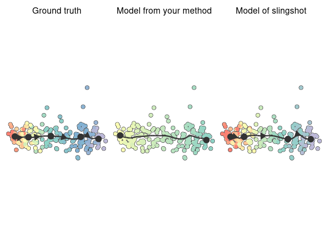

Topcoder single-cell trajectory inference competition
================

## Biological background

Cells are constantly changing based on external and internal stimuli.
These can include:

  - Cell differentiation, a process where cells go from a more stem-cell
    like state to a specialized state
  - Cell division, a process where cells replicate their DNA and split
    into two new cells
  - Cell activation, a process where cells are activated by their
    environment and react to it

There are several techniques to measure the current state of a cell. In
this competition we focus on the transcriptome of a cell, which can be
analyzed with *single-cell RNA-seq* technologies. In the recent years
these techniques have scaled up to being able to assess the expression
(i.e. activity) of thousands of genes within tens of thousands of cells.

The state of a cell often changes gradually, and so does its
transcriptome. If you profile different cells that are all at different
stages, you can reconstruct the paths that cells take. These paths are
called trajectories, and the methods that infers them from single-cell
data are called trajectory inference (TI) methods. An example of such a
trajectory is given below, visualized on a 2D dimensionality reduction
of a single-cell expression dataset.

<!-- -->

The topology of a trajectory can range from very simple (linear or
circular) to very complex (trees or disconnected graphs).

<!-- -->

## Problem description

You are given the expression of thousands of genes within thousands of
cells. This expression is given both in raw format (counts matrix) as in
a normalized format (expression matrix). The goal is to construct a
topology that represents these cells, and to place these cells on the
correct locations along this topology.


The topology is a graph structure, in this context called the milestone
network as it connects “milestones” that cells pass through. Each edge
within the milestone network can only be present once, and every edge
has an associated length, which indicates how much the gene expression
has changed between two milestones.

The cells are placed at a particular position of this milestone network.
We represent this as “progressions”, where each cell is assigned to an
edge and a percentage indicating how far it has progressed in that edge.

### Quick start

To get started, check out the examples we provided for different
programming languages. These examples infer a simple linear trajectory
by using the first component of a principal component analysis as
progression.

| Example                                       | Dockerfile                                              | Input                                                           | Onput                                                           |
| :-------------------------------------------- | :------------------------------------------------------ | :-------------------------------------------------------------- | :-------------------------------------------------------------- |
| [R](containers/methods/r)                     | [Dockerfile](containers/methods/r/Dockerfile)           | [main.R\#5](containers/methods/r/main.R#L5)                     | [main.R\#51](containers/methods/r/main.R#L51)                   |
| [Python](containers/methods/python)           | [Dockerfile](containers/methods/python/Dockerfile)      | [main.py\#9](containers/methods/python/main.py#L9)              | [main.py\#51](containers/methods/python/main.py#L51)            |
| [Julia](containers/methods/julia)             | [Dockerfile](containers/methods/julia/Dockerfile)       | [main.jl\#9](containers/methods/julia/main.jl#L9)               | [main.jl\#58](containers/methods/julia/main.jl#L58)             |
| [Scala-Spark](containers/methods/scala-spark) | [Dockerfile](containers/methods/scala-spark/Dockerfile) | [Main.scala\#28](containers/methods/scala-spark/Main.scala#L28) | [Main.scala\#67](containers/methods/scala-spark/Main.scala#L67) |

### Detailed description

You have to write a docker container that will read in the input files
and write out the output files in a mounted folder. This container has
to have an entrypoint that will ready in two command-line arguments: the
first contains the location of the input file, and the second the
location of the output folder. Examples of Dockerfiles (and associated
entrypoints) are provided for [R](containers/methods/r/Dockerfile),
[Python](containers/methods/python/Dockerfile),
[Julia](containers/methods/julia/Dockerfile) and
[Scala-Spark](containers/methods/scala-spark/Dockerfile). Make sure to
specify the entrypoint using the JSON notation as is shown in the
examples.

The input file is an HDF5 file, which contains two matrices: the counts
(`/data/counts`) and expression (`/data/expression`). These matrices
contain the expression of genes (columns) within hundreds to millions of
cells (rows). Example HDF5 files are present in the [examples inputs
folder](examples/inputs) (*dataset.h5*).

Because the data is very sparse, the matrices are stored inside a sparse
format: [Compressed sparse column format
(CSC)](https://docs.scipy.org/doc/scipy/reference/generated/scipy.sparse.csc_matrix.html).
We provided an example to read in these matrices for
[R](containers/methods/r/main.R#L5),
[Python](containers/methods/python/main.py#L9),
[Julia](containers/methods/julia/main.jl#L9) and
[Scala-Spark](containers/methods/scala-spark/Main.scala#L28) . This
format stores three sparse array, *i*, *p* and *x*. *x* contains the
actual values, *i* contains the row index for each value, and *p*
contains which of the elements of *i* and *x* are in each column (i.e.
*p*<sub><i>j</i></sub> until *p*<sub><i>j+1</i></sub> are the values
from *x* and *i* that are in column *j*). We also provide the
*rownames*, that correspond to cell identifiers, and the *dims*, the
dimensions of the matrix.

As output you have to provide two files. The *milestone\_network.csv* is
a table containing how milestones are connected (*from* and *to*) and
the lengths of these connections (*length*). The *progressions.csv*
contains for each cell (*cell\_id*) where it is located along this
topology (*from*, *to* and *percentage* ∈ \[0, 1\]). Both outputs have
to be saved as a comma separated file without an index but with header.
Example csv files are present in the [examples outputs
folder](examples/outputs) (*progressions.csv* and
*milestone\_network.csv*).

We provided an example to save these two objects for
[R](containers/methods/r/main.R#L51),
[Python](containers/methods/python/main.py#L51),
[Julia](containers/methods/julia/main.jl#L58) and
[Scala-Spark](containers/methods/scala-spark/Main.scala#L67)

## Evaluation

Your output will be compared to the known (or expected) trajectory
within both synthetic and real datasets. This is done using five
metrics, each contributing (on average) 1/5th to the overall score.

  - Similarity between the topology
  - Similarity between the position of cells on particular branches
  - Similarity between the relative positions of cells within the
    trajectory
  - Similarity between features that change along the trajectory
  - Running time: The average running time in seconds, through a log
    transformation, and scaled so that ⩽ 1 second has score 1, and ⩾ 1
    hour has score 0.

The first four metrics are aggregated for each dataset using a geometric
mean. That means that low values (i.e. close to zero) for any of the
metrics results in a low score overall. They are weighted so that:

  - A slight difference in performance for more difficult datasets is
    more important than an equally slight difference for an easy dataset
  - Datasets with a more rare trajectory type (e.g. tree) are given
    relatively more weight than frequent topologies (e.g. linear)

## Evaluating on one dataset locally

You can run a method and evaluation locally using the provided docker
containers. An example of this is provided in
[scripts/example.sh](scripts/example.sh). This requires two additional
docker containers that are distributed through docker hub: a convertor
to convert the output to the format used by the
[dynverse](https://dynverse.org) R packages, and an evaluator that reads
in the output file together with the ground truth HDF5 file to produce
scores.


After conversion, you have access to all R
[dynverse](https://dynverse.org) packages for visualizing the
trajectories, e.g.:

``` r
# First time users should run this:
# install.packages("devtools")
# devtools::install_github("dynverse/dyno")

library(dyno, quietly = TRUE)
```

    ## 
    ## Attaching package: 'dynplot'

    ## The following objects are masked from 'package:dynplot2':
    ## 
    ##     empty_plot, example_bifurcating, example_disconnected,
    ##     example_linear, example_tree, get_milestone_palette_names,
    ##     theme_clean, theme_graph

``` r
# load in the model and groundtruth
model <- dynutils::read_h5("results/model.h5")
dataset <- dynutils::read_h5("examples/inputs/linear.h5")
groundtruth <- dynutils::read_h5("examples/ground-truths/linear.h5")

# add a dimensionality reduction to the ground truth using landmark MDS
groundtruth <- groundtruth %>% add_dimred(dyndimred::dimred_landmark_mds)
dimred <- groundtruth$dimred

# also infer a trajectory using one of the current state-of-the-art methods, e.g. slingshot
model2 <- infer_trajectory(groundtruth, dynmethods::ti_slingshot())

# plot both the groundtruth and model
patchwork::wrap_plots(
  dynplot::plot_dimred(groundtruth, dimred = dimred) + ggtitle("Ground truth"),
  dynplot::plot_dimred(model, dimred = dimred) + ggtitle("Model from your method"),
  dynplot::plot_dimred(model2, dimred = dimred) + ggtitle("Model of slingshot")
)
```

    ## Coloring by milestone

    ## Using milestone_percentages from trajectory

    ## Coloring by milestone

    ## Using milestone_percentages from trajectory

    ## Coloring by milestone

    ## Using milestone_percentages from trajectory

<!-- -->

## Evaluating on all datasets locally

To build a sample TC submission from
[containers/tc-submissions](containers/tc-submissions) folder do in root
of this repo:

    $ sudo docker build -t single-cell-submission \
      -f tc-submissions/submission-python/code/Dockerfile \
      tc-submissions/submission-python/code

To run resulting submission against example inputs do:

    $ sudo docker run -v $(pwd)/examples/inputs:/inputs \
      -v $(pwd)/results/:/outputs single-cell-submission /inputs /outputs

To build TC scorer do:

    $ sudo docker build -t single-cell-scorer -f tc-scorer/Dockerfile \
      tc-scorer

To score results generated before do:

    $ sudo docker run \
      -v $(pwd)/results:/outputs \
      -v $(pwd)/examples/inputs:/inputs \
      -v $(pwd)/examples/ground-truths:/ground-truths \
      -v $(pwd)/examples/
      single-cell-scorer 10000

where the last argument should be the overal runtime \[ms\] of solution
on all datasets. The accuracy score will be decreased exponentially the
longer this time is. If that argument is zero or not present, the
aggregated score will be equal to the accuracy score.

## Hints

First hint: the hints won’t give necessarily a better result. They just
reflect common current practices.

### Normalization of datasets

Single-cell RNA-seq datasets are often normalized so that the expression
of different cells is more comparable. This can involve

  - Dividing the counts of each cell by the total number of counts per
    cell
  - Log2 normalisation
  - Many more complex approaches that are available in packages such as
    [scran](https://bioconductor.org/packages/release/bioc/html/scran.html)
    (R/Bioconductor),
    [sctransform](https://github.com/ChristophH/sctransform) (R) and
    [scanpy](https://scanpy.readthedocs.io/en/stable/) (Python).

Whether normalisation is necessary depends on what you do with the data.
For example, it will be more important if you calculate some euclidean
distances, but useless if you calculate rank correlations.

### Difficulty of datasets

There is a broad gradient of difficulty among the datasets. Some
datasets could be solved by pen and paper, while others may almost be
impossible to correctly define the trajectory. Don’t try to optimise a
method for all datasets, but rather try to learn from datasets that are
next in your “difficulty” frontier.

You can get an overview of the estimated difficulty of a dataset in the
[datasets/training/difficulties.csv](datasets/training/difficulties.csv).
The `overall_mean` columns gives you the difficulty rating for all
scores combined (the lower the more difficult). One factor in the
difficulty is the kind of trajectory topology: linear and bifurcating
datasets are often easier than graph or tree datasets.


## Further reading

[**A comparison of single-cell trajectory inference methods
(2019)**](http://em.rdcu.be/wf/click?upn=lMZy1lernSJ7apc5DgYM8RY2IzMp2w2A3DvtZzsJuXQ-3D_pHvsHvhfQaoNOkiaWNdPTjEYljnHm5S7EpH3PfJ5poSURd1eHm2H4ZrZffcWuk-2FVAindB7MLQFXJP7SDz5ymc76HIgI5DN8-2FH4-2F0TSTEWycfk1kcZnplv69A2DcepMUlm91KK1RoNKzOirYAwv80Lt5hqKoaTim-2B0sBTAo6vy56EGHpLul12jZ1a9APM7IdmLQr043l6b9bkFfA7ziZOCz0RTd1L7AMKVtxjW5BlMgjfDbYlrbJoP98nzAtGp0amLM5xaU0-2FmLwX0enc7rmd9Q-3D-3D):
Benchmarking study of current state-of-the-art methods for trajectory
inference. <https://doi.org/10.1038/s41587-019-0071-9>

[**Concepts and limitations for learning developmental trajectories from
single cell genomics (2019)**](https://doi.org/10.1242/dev.170506): A
review on trajectory inference algorithms
