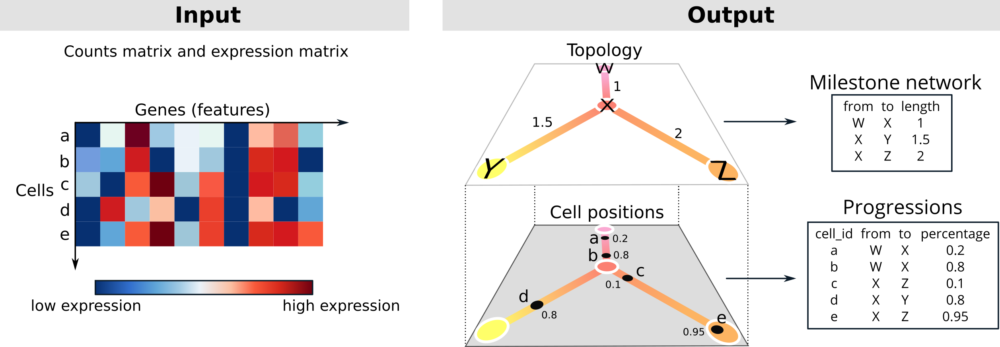
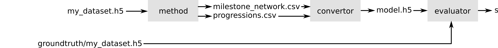

```{r setup, include=FALSE}
knitr::opts_chunk$set(echo = TRUE)
library(hdf5r)

library(purrr)
library(stringr)
library(dplyr)
library(tibble)
library(readr)

library(dynplot2)
library(ggplot2)
library(dynwrap)
```

```{r, echo = FALSE}
find_input_line <- function(x) {
  read_lines(x) %>% 
    stringr::str_which("##### Read data #####")
}
find_output_line <- function(x) {
    read_lines(x) %>% 
    stringr::str_which("##### Save output #####")
}

examples <- tribble(
  ~language,
  "R",
  "Python",
  "Julia",
  "Scala-Spark"
) %>% 
  mutate(folder = paste0("../containers/methods/", tolower(language))) %>% 
  mutate(main = fs::dir_ls(folder, regexp = ".*[Mm]ain*")) %>% 
  mutate(
    input_line = map_int(main, find_input_line),
    output_line = map_int(main, find_output_line),
    main_filename = fs::path_file(main)
  )

label_sentence <- function(x) {
  if (length(x) == 0) {
    ""
  } else if (length(x) == 1) {
    x
  } else {
    glue::glue_collapse(x, sep = ", ", last = " and ")
  }
}
```


## Biological background

Cells are constantly changing based on external and internal stimuli. These can include:

- Cell differentiation, a process where cells go from a more stem-cell like state to a specialized state
- Cell division, a process where cells replicate their DNA and split into two new cells
- Cell activation, a process where cells are activated by their environment and react to it

There are several techniques to measure the current state of a cell. In this competition we focus on the transcriptome of a cell, which can be analyzed with _single-cell RNA-seq_ technologies. In the recent years these techniques have scaled up to being able to assess the expression (i.e. activity) of thousands of genes within tens of thousands of cells.

The state of a cell often changes gradually, and so does its transcriptome. If you profile different cells that are all at different stages, you can reconstruct the paths that cells take. These paths are called trajectories, and the methods that infers them from single-cell data are called trajectory inference (TI) methods. An example of such a trajectory is given below, visualized on a 2D dimensionality reduction of a single-cell expression dataset.

```{r, echo = FALSE, fig.width=10, message=FALSE}
set.seed(1)

dataset <- dynplot2::example_bifurcating %>% 
  add_dimred(dyndimred::dimred_landmark_mds)

theme <- theme(
  panel.border = element_rect(colour = "black", fill=NA, size=1, color = "#999999"),
  legend.position = "none",
  plot.caption = element_text(hjust = 0.5, size = 11)
)

plot_dataset <- dataset %>% 
  dynplot() +
  geom_cell_point() +
  labs(caption = "A small single-cell dataset visualized in two dimensions using PCA.\n Each dot represents one cell.") +
  theme
plot_trajectory <- dataset %>% 
  dynplot() +
  geom_cell_point(color = "grey") +
  geom_trajectory_segments(aes(colour = milestone_percentages), size = 2) +
  geom_milestone_label(aes(fill = milestone_id)) +
  scale_milestones_fillcolour() +
  labs(caption = "A trajectory inferred from the data, \nwith four milestones (M1, M2, M3 and M4) \nand a bifurcation point at M3.") +
  theme

patchwork::wrap_plots(
  plot_dataset,
  plot_trajectory
)
```

The topology of a trajectory can range from very simple (linear or circular) to very complex (trees or disconnected graphs).

```{r, echo = FALSE, message = FALSE}
datasets <- list(
  linear = dynplot2::example_linear,
  bifurcating = dynplot2::example_bifurcating,
  tree = dynplot2::example_tree,
  disconnected = dynplot2::example_disconnected
)

plot_trajectories <- map2(names(datasets), datasets, function(topology, dataset) {
  plot_trajectory <- dataset %>% 
  dynplot() +
  geom_cell_point(color = "grey") +
  geom_trajectory_segments(aes(colour = milestone_percentages), size = 2, arrow = NULL) +
  scale_milestones_fillcolour() +
  labs(caption = paste0("A ", topology, " trajectory")) +
  theme
})


patchwork::wrap_plots(plot_trajectories)
```

## Problem description

You are given the expression of thousands of genes within thousands of cells. This expression is given both in raw format (counts matrix) as in a normalized format (expression matrix). The goal is to construct a topology that represents these cells, and to place these cells on the correct locations along this topology.



The topology is a graph structure, in this context called the milestone network as it connects "milestones" that cells pass through. Each edge within the milestone network can only be present once, and every edge has an associated length, which indicates how much the gene expression has changed between two milestones.

The cells are placed at a particular position of this milestone network. We represent this as "progressions", where each cell is assigned to an edge and a percentage indicating how far it has progressed in that edge.

### Quick start

To get started, check out the examples we provided for different programming languages. These examples infer a simple linear trajectory by using the first component of a principal component analysis as progression.

```{r, echo = FALSE}
examples %>% 
  mutate(
    show_Example = str_glue("[{language}]({folder})"),
    show_Dockerfile = str_glue("[Dockerfile]({folder}/Dockerfile)"),
    show_Input = str_glue("[{main_filename}#{input_line}]({main}#L{input_line})"),
    show_Onput = str_glue("[{main_filename}#{output_line}]({main}#L{output_line})")
  ) %>% 
  select(matches("show_")) %>% 
  rename_all(~substr(., 6, 9999)) %>% 
  knitr::kable()
```

### Detailed description

You have to write a docker container that will read in the input files and write out the output files in a mounted folder. This container has to have an entrypoint that will ready in two command-line arguments: the first contains the location of the input file, and the second the location of the output folder. Examples of Dockerfiles (and associated entrypoints) are provided for `r examples %>% mutate(link_input = str_glue("[{language}]({folder}/Dockerfile)")) %>% pull(link_input) %>% label_sentence()`. Make sure to specify the entrypoint using the JSON notation as is shown in the examples.

```{r, echo = FALSE}
# read_lines(paste0(examples %>% filter(language == "Python") %>% pull(folder), "/Dockerfile")) %>% c("```python", ., "```") %>% paste0(collapse = "\n") %>% knitr::asis_output()
```

The input file is an HDF5 file, which contains two matrices: the counts (`/data/counts`) and expression (`/data/expression`). These matrices contain the expression of genes (columns) within hundreds to millions of cells (rows). Example HDF5 files are present in the [examples input folder](../examples/input) (_dataset.h5_).

Because the data is very sparse, the matrices are stored inside a sparse format: [Compressed sparse column format (CSC)](https://docs.scipy.org/doc/scipy/reference/generated/scipy.sparse.csc_matrix.html). We provided an example to read in these matrices for `r examples %>% mutate(link_input = str_glue("[{language}]({main}#L{input_line})")) %>% pull(link_input) %>% label_sentence()` . This format stores three sparse array, _i_, _p_ and _x_. _x_ contains the actual values, _i_ contains the row index for each value, and _p_ contains which of the elements of _i_ and _x_ are in each column (i.e. _p_<sub><i>j</i></sub> until _p_<sub><i>j+1</i></sub> are the values from _x_ and _i_ that are in column _j_). We also provide the _rownames_, that correspond to cell identifiers, and the _dims_, the dimensions of the matrix.

As output you have to provide two files. The _milestone\_network.csv_ is a table containing how milestones are connected (_from_ and _to_) and the lengths of these connections (_length_). The _progressions.csv_ contains for each cell (_cell\_id_) where it is located along this topology (_from_, _to_ and _percentage_ ∈ [0, 1]). Both outputs have to be saved as a comma separated file without an index but with header. Example csv files are present in the [examples output folder](../examples/output) (_progressions.csv_ and _milestone\_network.csv_).

We provided an example to save these two objects for `r examples %>% mutate(link_input = str_glue("[{language}]({main}#L{output_line})")) %>% pull(link_input) %>% label_sentence()`

## Evaluation

Your output will be compared to the known (or expected) trajectory within both synthetic and real data. This is done using four metrics, as described in [[@Saelens_Cannoodt_Todorov_Saeys_2019]](https://doi.org/10.1038/s41587-019-0071-9):

- Similarity between the topology
- Similarity between the position of cells on particular branches
- Similarity between the relative positions of cells within the trajectory
- Similarity between features that change along the trajectory

Each of these values lie between 0 and 1, where 1 is perfect.

Your submission is also evaluated on the average running time.

## Evaluating locally

You can run a method and evaluation locally using the provided docker containers. An example of this is provided in [scripts/example.sh](../scripts/example.sh). This requires two additional docker containers that are distributed through docker hub: a convertor to convert the output to the format used by the [dynverse](https://dynverse.org) R packages, and an evaluator that reads in the output file together with the ground truth HDF5 file to produce scores.



After conversion, you have access to all R [dynverse](https://dynverse.org) packages for visualizing the trajectories, e.g.:

```{r, include = FALSE}
set.seed(1)
```

```{r, message=FALSE}
library(dyno, quietly = TRUE)

# load in the model and groundtruth
model <- dynutils::read_h5("../results/model.h5")
dataset <- dynutils::read_h5("../examples/input/linear.h5")
groundtruth <- dynutils::read_h5("../examples/input/groundtruth/linear.h5")

# add a dimensionality reduction to the ground truth using landmark MDS
groundtruth <- groundtruth %>% add_dimred(dyndimred::dimred_landmark_mds)
dimred <- groundtruth$dimred

# also infer a trajectory using one of the current state-of-the-art methods, e.g. slingshot
model2 <- infer_trajectory(groundtruth, dynmethods::ti_slingshot())

# plot both the groundtruth and model
patchwork::wrap_plots(
  dynplot::plot_dimred(groundtruth, dimred = dimred) + ggtitle("Ground truth"),
  dynplot::plot_dimred(model, dimred = dimred) + ggtitle("Model from your method"),
  dynplot::plot_dimred(model2, dimred = dimred) + ggtitle("Model of slingshot")
)
```

## Further reading
