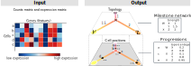

```{r setup, include=FALSE}
knitr::opts_chunk$set(echo = TRUE)
library(hdf5r)
library(DiagrammeR)

library(purrr)
library(stringr)
library(dplyr)
library(tibble)
library(readr)

library(dynplot2)
library(ggplot2)
library(dynwrap)
```

```{r, echo = FALSE}
find_input_line <- function(x) {
  read_lines(x) %>% 
    stringr::str_which("^# Read data")
}
find_output_line <- function(x) {
    read_lines(x) %>% 
    stringr::str_which("^# Save output")
}

examples <- tribble(
  ~language,
  "R",
  "Python",
  "Julia"
) %>% 
  mutate(folder = paste0("../containers/methods/", tolower(language))) %>% 
  mutate(main = fs::dir_ls(folder, glob = "*main*")) %>% 
  mutate(
    input_line = map_int(main, find_input_line),
    output_line = map_int(main, find_output_line),
    main_filename = fs::path_file(main)
  )

label_sentence <- function(x) {
  if (length(x) == 0) {
    ""
  } else if (length(x) == 1) {
    x
  } else {
    glue::glue_collapse(x, sep = ", ", last = " and ")
  }
}
```


## Biological background

Cells are constantly changing based on external and internal stimuli. These can include:

- Cell differentiation, a process where cells go from a more stem-cell like state to a specialized state
- Cell division, a process where cells replicate their DNA and split into two new cells
- Cell activate, a process where cells are activated by their environment and react to it

There are several techniques to measure the current state of a cell. In this competition we focus on the activity of protein coding genes with a cell, which can be analyzed with _single-cell RNA-seq_ technologies. In the recent years these techniques have scaled up to being able to assess the expression (i.e. activity) of thousands of genes within tens of thousands of cells.

The state of a cell often changes gradually, and so does its transcriptome. If you profile different cells that are all at different stages, you can reconstruct the paths that cells take. These paths are called trajectories, and the methods that infers them from single-cell data are called trajectory inference (TI) methods. An example of such a trajectory is given below, visualized on a 2D dimensionality reduction of a single-cell expression dataset.

```{r, echo = FALSE, fig.width=10, message=FALSE}
dataset <- dynplot2::example_bifurcating %>% 
  add_dimred(dyndimred::dimred_landmark_mds)

theme <- theme(
  panel.border = element_rect(colour = "black", fill=NA, size=1, color = "#999999"),
  legend.position = "none",
  plot.caption = element_text(hjust = 0.5, size = 11)
)

plot_dataset <- dataset %>% 
  dynplot() +
  geom_cell_point() +
  labs(caption = "A small single-cell dataset visualized \nin two dimensions using MDS") +
  theme
plot_trajectory <- dataset %>% 
  dynplot() +
  geom_cell_point(color = "grey") +
  geom_trajectory_segments(aes(colour = milestone_percentages), size = 2) +
  geom_milestone_label(aes(fill = milestone_id)) +
  scale_milestones_fillcolour() +
  labs(caption = "A trajectory inferred from the data, \nwith four milestones (M1, M2, M3 and M4) \nand a bifurcation point at M3") +
  theme

patchwork::wrap_plots(
  plot_dataset,
  plot_trajectory
)
```

The topology of a trajectory can range from very simple (linear or circular) to very complex (trees or disconnected graphs).

```{r, echo = FALSE, message = FALSE}
datasets <- list(
  linear = dynplot2::example_linear,
  bifurcating = dynplot2::example_bifurcating,
  tree = dynplot2::example_tree,
  disconnected = dynplot2::example_disconnected
)

plot_trajectories <- map2(names(datasets), datasets, function(topology, dataset) {
  plot_trajectory <- dataset %>% 
  dynplot() +
  geom_cell_point(color = "grey") +
  geom_trajectory_segments(aes(colour = milestone_percentages), size = 2, arrow = NULL) +
  scale_milestones_fillcolour() +
  labs(caption = paste0("A ", topology, " trajectory")) +
  theme
})


patchwork::wrap_plots(plot_trajectories)
```

## Problem description

You are given the expression of thousands of genes within thousands of cells. This expression is given both in raw format (counts matrix) as in a normalized format (expression matrix). The goal is to construct a topology that represents these cells, and to place these cells on the correct locations along this topology.



## Input and output format

To get started, check out the examples we provided for different programming languages:

```{r, echo = FALSE}
examples %>% 
  mutate(
    show_Example = str_glue("[{language}]({folder})"),
    show_Dockerfile = str_glue("[Dockerfile]({folder}/Dockerfile)"),
    show_Input = str_glue("[{main_filename}#{input_line}]({main}#{input_line})"),
    show_Onput = str_glue("[{main_filename}#{output_line}]({main}#{output_line})")
  ) %>% 
  select(matches("show_")) %>% 
  rename_all(~substr(., 6, 9999)) %>% 
  knitr::kable()
```

You have to write a docker container that reads in two command-line arguments, the first contains the location of an input file, and the second the location of the output folder, within the container.

The input file is an HDF5 file, which contains two matrices: the counts (the raw data matrix) and expression (a log normalized derivation of the counts). These matrices contain the expression of genes (columns) within hundreds to millions of cells (rows). Example HDF5 files are present in the [examples folder](../examples) (_dataset.h5_).

Because the data is very sparse, the matrices are stored inside a sparse format: [Compressed sparse column format (CSC)](https://en.wikipedia.org/wiki/Sparse_matrix#Compressed_sparse_column_(CSC_or_CCS)). We provided an example to read in these matrices for `r examples %>% mutate(link_input = str_glue("[{language}]({main}#{input_line})")) %>% pull(link_input) %>% label_sentence()`

As output you have to provide two files. The milestone network is a table containing how milestones are connected (_from_ and _to_) and the lengths of these connections (_length_). The progressions contains for each cell (_cell\_id_) where it is located along this topology (_from_, _to_ and _percentage_ ∈ [0, 1]). Each cell can only be present on one edge. Both outputs have to be saved as a comma separated file without an index but with header.

We provided an example to save these two objects for `r examples %>% mutate(link_input = str_glue("[{language}]({main}#{input_line})")) %>% pull(link_input) %>% label_sentence()`

## Evaluation

Your output will be compared to the known (or expected) trajectory within both synthetic and real data. This is done using four metrics, as described in [@Saelens_Cannoodt_Todorov_Saeys_2019]:

- Similarity between the topology
- Similarity between the position of cells on particular branches
- Similarity between the relative positions of cells within the trajectory
- Similarity between features that change along the trajectory

Your submission is also evaluated on the average running time.

## Further reading
