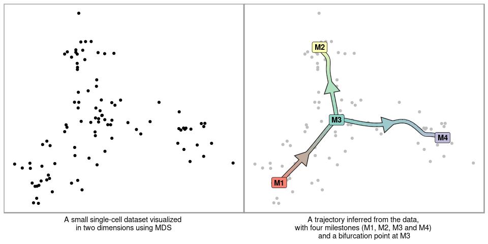
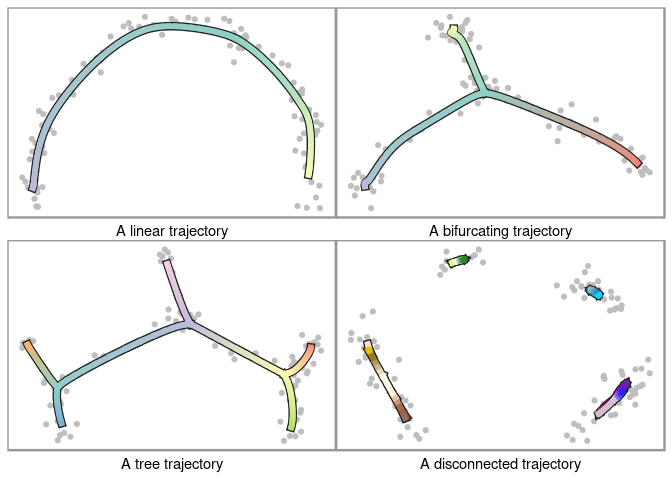

Topcoder single-cell trajectory inference competition
================

## Biological background

Cells are constantly changing based on external and internal stimuli.
These can include:

  - Cell differentiation, a process where cells go from a more stem-cell
    like state to a specialized state
  - Cell division, a process where cells replicate their DNA and split
    into two new cells
  - Cell activate, a process where cells are activated by their
    environment and react to it

There are several techniques to measure the current state of a cell. In
this competition we focus on the activity of protein coding genes with a
cell, which can be analyzed with *single-cell RNA-seq* technologies. In
the recent years these techniques have scaled up to being able to assess
the expression (i.e. activity) of thousands of genes within tens of
thousands of cells.

The state of a cell often changes gradually, and so does its
transcriptome. If you profile different cells that are all at different
stages, you can reconstruct the paths that cells take. These paths are
called trajectories, and the methods that infers them from single-cell
data are called trajectory inference (TI) methods. An example of such a
trajectory is given below, visualized on a 2D dimensionality reduction
of a single-cell expression dataset.

<!-- -->

The topology of a trajectory can range from very simple (linear or
circular) to very complex (trees or disconnected graphs).

<!-- -->

## Problem description

You are given the expression of thousands of genes within thousands of
cells. This expression is given both in raw format (counts matrix) as in
a normalized format (expression matrix). The goal is to construct a
topology that represents these cells, and to place these cells on the
correct locations along this topology.

## Input and output format

To get started, check out the examples we provided for different
programming
languages:

| Example                                | Dockerfile                                            | Input                                                 | Onput                                                   |
| :------------------------------------- | :---------------------------------------------------- | :---------------------------------------------------- | :------------------------------------------------------ |
| [R](../containers/methods/r)           | [Dockerfile](../containers/methods/r/Dockerfile)      | [main.R\#5](../containers/methods/r/main.R#L5)        | [main.R\#52](../containers/methods/r/main.R#L52)        |
| [Python](../containers/methods/python) | [Dockerfile](../containers/methods/python/Dockerfile) | [main.py\#9](../containers/methods/python/main.py#L9) | [main.py\#51](../containers/methods/python/main.py#L51) |
| [Julia](../containers/methods/julia)   | [Dockerfile](../containers/methods/julia/Dockerfile)  | [main.jl\#9](../containers/methods/julia/main.jl#L9)  | [main.jl\#58](../containers/methods/julia/main.jl#L58)  |

You have to write a docker container that reads in two command-line
arguments, the first contains the location of an input file, and the
second the location of the output folder, within the container.

The input file is an HDF5 file, which contains two matrices: the counts
(the raw data matrix) and expression (a log normalized derivation of the
counts). These matrices contain the expression of genes (columns) within
hundreds to millions of cells (rows). Example HDF5 files are present in
the [examples input folder](../examples/input) (*dataset.h5*).

Because the data is very sparse, the matrices are stored inside a sparse
format: [Compressed sparse column format
(CSC)](https://en.wikipedia.org/wiki/Sparse_matrix#Compressed_sparse_column_\(CSC_or_CCS\)).
We provided an example to read in these matrices for
[R](../containers/methods/r/main.R#5),
[Python](../containers/methods/python/main.py#9) and
[Julia](../containers/methods/julia/main.jl#9)

As output you have to provide two files. The milestone network is a
table containing how milestones are connected (*from* and *to*) and the
lengths of these connections (*length*). The progressions contains for
each cell (*cell\_id*) where it is located along this topology (*from*,
*to* and *percentage* ∈ \[0, 1\]). Each cell can only be present on one
edge. Both outputs have to be saved as a comma separated file without an
index but with header. Example csv files are present in the [examples
output folder](../examples/output) (*progressions.csv* and
*milestone\_network.csv*).

We provided an example to save these two objects for
[R](../containers/methods/r/main.R#5),
[Python](../containers/methods/python/main.py#9) and
[Julia](../containers/methods/julia/main.jl#9)

## Evaluation

Your output will be compared to the known (or expected) trajectory
within both synthetic and real data. This is done using four metrics, as
described in (Saelens et al. 2019):

  - Similarity between the topology
  - Similarity between the position of cells on particular branches
  - Similarity between the relative positions of cells within the
    trajectory
  - Similarity between features that change along the trajectory

Your submission is also evaluated on the average running time.

## Further reading

Saelens, Wouter, Robrecht Cannoodt, Helena Todorov, and Yvan Saeys.
2019. “A Comparison of Single-Cell Trajectory Inference Methods.”
*Nature Biotechnology* 37 (5): 547.
<https://doi.org/10.1038/s41587-019-0071-9>.

