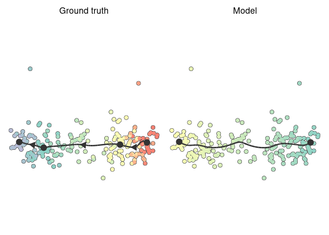

Topcoder single-cell trajectory inference competition
================

## Biological background

Cells are constantly changing based on external and internal stimuli.
These can include:

  - Cell differentiation, a process where cells go from a more stem-cell
    like state to a specialized state
  - Cell division, a process where cells replicate their DNA and split
    into two new cells
  - Cell activation, a process where cells are activated by their
    environment and react to it

There are several techniques to measure the current state of a cell. In
this competition we focus on the transcriptome of a cell, which can be
analyzed with *single-cell RNA-seq* technologies. In the recent years
these techniques have scaled up to being able to assess the expression
(i.e. activity) of thousands of genes within tens of thousands of cells.

The state of a cell often changes gradually, and so does its
transcriptome. If you profile different cells that are all at different
stages, you can reconstruct the paths that cells take. These paths are
called trajectories, and the methods that infers them from single-cell
data are called trajectory inference (TI) methods. An example of such a
trajectory is given below, visualized on a 2D dimensionality reduction
of a single-cell expression dataset.

<!-- -->

The topology of a trajectory can range from very simple (linear or
circular) to very complex (trees or disconnected graphs).

<!-- -->

## Problem description

You are given the expression of thousands of genes within thousands of
cells. This expression is given both in raw format (counts matrix) as in
a normalized format (expression matrix). The goal is to construct a
topology that represents these cells, and to place these cells on the
correct locations along this topology.


The topology is a graph structure, in this context called the milestone
network as it connects “milestones” that cells pass through. Each edge
within the milestone network can only be present once, and every edge
has an associated length, which indicates how much the gene expression
has changed between two milestones.

The cells are placed at a particular position of this milestone network.
We represent this as “progressions”, where each cell is assigned to an
edge and a percentage indicating how far it has progressed in that edge.

### Quick start

To get started, check out the examples we provided for different
programming languages. These examples infer a simple linear trajectory
by using the first component of a principal component analysis as
progression.

| Example                                | Dockerfile                                            | Input                                                 | Onput                                                   |
| :------------------------------------- | :---------------------------------------------------- | :---------------------------------------------------- | :------------------------------------------------------ |
| [R](../containers/methods/r)           | [Dockerfile](../containers/methods/r/Dockerfile)      | [main.R\#5](../containers/methods/r/main.R#L5)        | [main.R\#51](../containers/methods/r/main.R#L51)        |
| [Python](../containers/methods/python) | [Dockerfile](../containers/methods/python/Dockerfile) | [main.py\#9](../containers/methods/python/main.py#L9) | [main.py\#51](../containers/methods/python/main.py#L51) |
| [Julia](../containers/methods/julia)   | [Dockerfile](../containers/methods/julia/Dockerfile)  | [main.jl\#9](../containers/methods/julia/main.jl#L9)  | [main.jl\#58](../containers/methods/julia/main.jl#L58)  |

### Detailed description

You have to write a docker container that will read in the input files
and write out the output files in a mounted folder. This container has
to have an entrypoint that will ready in two command-line arguments: the
first contains the location of the input file, and the second the
location of the output folder. Examples of Dockerfiles (and associated
entrypoints) are provided for [R](../containers/methods/r/Dockerfile),
[Python](../containers/methods/python/Dockerfile) and
[Julia](../containers/methods/julia/Dockerfile). Make sure to specify
the entrypoint using the JSON notation as is shown in the examples.

The input file is an HDF5 file, which contains two matrices: the counts
(`/data/counts`) and expression (`/data/expression`). These matrices
contain the expression of genes (columns) within hundreds to millions of
cells (rows). Example HDF5 files are present in the [examples input
folder](../examples/input) (*dataset.h5*).

Because the data is very sparse, the matrices are stored inside a sparse
format: [Compressed sparse column format
(CSC)](https://docs.scipy.org/doc/scipy/reference/generated/scipy.sparse.csc_matrix.html).
We provided an example to read in these matrices for
[R](../containers/methods/r/main.R#L5),
[Python](../containers/methods/python/main.py#L9) and
[Julia](../containers/methods/julia/main.jl#L9) . This format stores
three sparse array, *i*, *p* and *x*. *x* contains the actual values,
*i* contains the row index for each value, and *p* contains which of the
elements of *i* and *x* are in each column (i.e. *p*<sub><i>j</i></sub>
until *p*<sub><i>j+1</i></sub> are the values from *x* and *i* that are
in column *j*). We also provide the *rownames*, that correspond to cell
identifiers, and the *dims*, the dimensions of the matrix.

As output you have to provide two files. The *milestone\_network.csv* is
a table containing how milestones are connected (*from* and *to*) and
the lengths of these connections (*length*). The *progressions.csv*
contains for each cell (*cell\_id*) where it is located along this
topology (*from*, *to* and *percentage* ∈ \[0, 1\]). Both outputs have
to be saved as a comma separated file without an index but with header.
Example csv files are present in the [examples output
folder](../examples/output) (*progressions.csv* and
*milestone\_network.csv*).

We provided an example to save these two objects for
[R](../containers/methods/r/main.R#L51),
[Python](../containers/methods/python/main.py#L51) and
[Julia](../containers/methods/julia/main.jl#L58)

## Evaluation

Your output will be compared to the known (or expected) trajectory
within both synthetic and real data. This is done using four metrics, as
described in [(Saelens et
al. 2019)](https://doi.org/10.1038/s41587-019-0071-9):

  - Similarity between the topology
  - Similarity between the position of cells on particular branches
  - Similarity between the relative positions of cells within the
    trajectory
  - Similarity between features that change along the trajectory

Each of these values lie between 0 and 1, where 1 is perfect.

Your submission is also evaluated on the average running time.

## Evaluating locally

You can run a method and evaluation locally using the provided docker
containers. An example of this is provided in
[scripts/example.sh](../scripts/example.sh). This requires two
additional docker containers that are distributed through docker hub: a
convertor to convert the output to the format used by the
[dynverse](https://dynverse.org) R packages, and an evaluator that reads
in the output file together with the ground truth HDF5 file to produce
scores.


After conversion, you have access to all R
[dynverse](https://dynverse.org) packages for visualizing the
trajectories, e.g.:

``` r
library(dyno, quietly = TRUE)

# load in the model and groundtruth
model <- dynutils::read_h5("../results/model.h5")
groundtruth <- dynutils::read_h5("../examples/input/groundtruth/linear.h5")

# add a dimensionality reduction to the ground truth using landmark MDS
groundtruth <- groundtruth %>% add_dimred(dyndimred::dimred_landmark_mds)
dimred <- groundtruth$dimred

# plot both the groundtruth and model
patchwork::wrap_plots(
  dynplot::plot_dimred(groundtruth, dimred = dimred) + ggtitle("Ground truth"),
  dynplot::plot_dimred(model, dimred = dimred) + ggtitle("Model")
)
```

<!-- -->

## Further reading

<div id="refs" class="references">

<div id="ref-Saelens_Cannoodt_Todorov_Saeys_2019">

Saelens, Wouter, Robrecht Cannoodt, Helena Todorov, and Yvan Saeys.
2019. “A Comparison of Single-Cell Trajectory Inference Methods.”
*Nature Biotechnology* 37 (5): 547.
<https://doi.org/10.1038/s41587-019-0071-9>.

</div>

</div>
